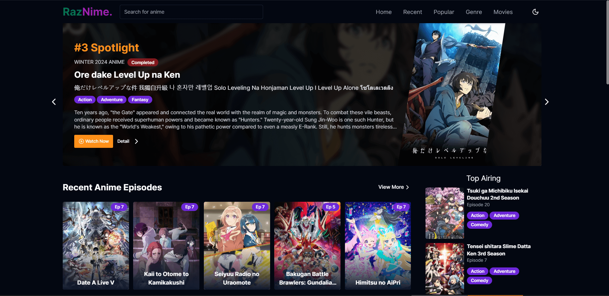
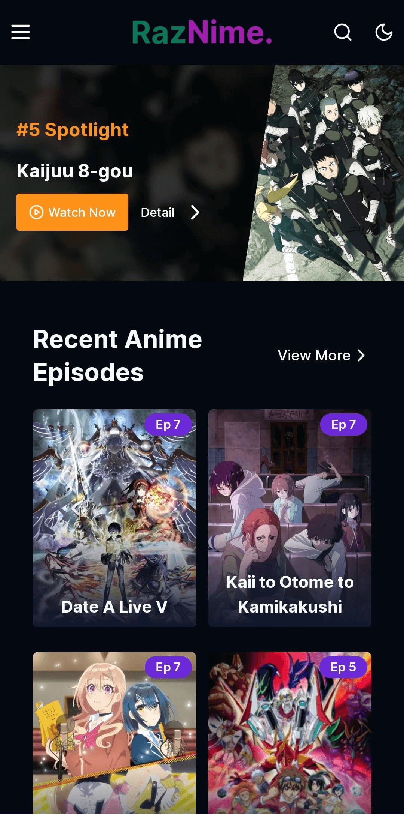
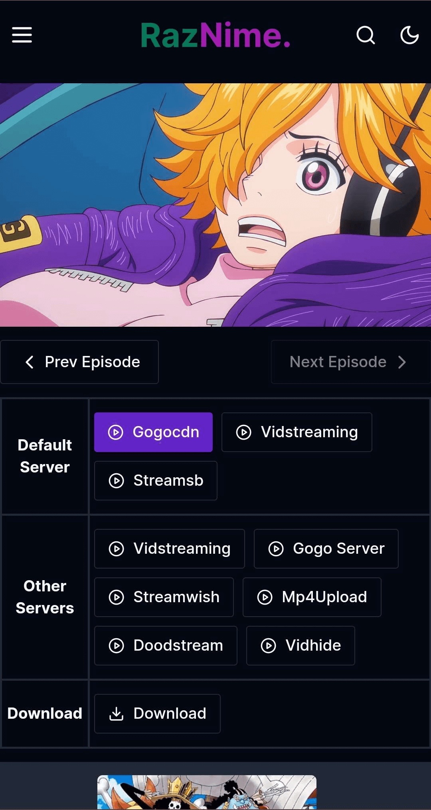

# Raznime

Anime streaming website with next-14, [powered by Consumet Api](https://github.com/consumet/api.consumet.org)

### Demo: https://raznime-next-14.vercel.app




<table>
  <tr>
    <td></td>
    <td></td>
  </tr>
</table>

This is the frontend part of an anime streaming website built with Next.js 14. It provides a user-friendly platform for streaming and exploring a wide range of anime content.

**Note:** This project is the frontend part only. For the backend, this project uses [CONSUMET API](https://github.com/consumet/api.consumet.org), so when setting up this project you need to add the CONSUMET API endpoint to your `.env` file.

⚠️ **Please Note: This project is still under active development. Some features may be incomplete or subject to change. Use it for demonstration purposes, but be aware that it's a work in progress.**

## Table of Contents

- [Setup](#setup)
- [Features](#features)
- [3rd-party APIs](#3rd-party-apis)
- [License](#license)

## Setup

1. Clone this project.
2. Navigate to the project directory.
3. Install project dependencies:

```bash
npm install
```

4. Setup `.env`

```
CONSUMET_API_BASE_URL=your_consumet_api_url
```

For local setup or host your own Consumet Api, you can take a look at [CONSUMET API](https://github.com/consumet/api.consumet.org)

5. Start the development server:

```bash
npm run dev
```

Open [http://localhost:3005](http://localhost:3005) with your browser to see the result.

## Features

- **Dark and Light Theme**: This website support both light and dark theme.
- **Search and Global Search Field**: Search for your favorite anime by title or keywords.
- **Infinite Scroll**: We are using infinite scroll instead of pagination for this website.
- **Pages that provide ton of animes based on**:
  - **Recent Released Anime Episode**
  - **Popular Anime**
  - **Top airing anime**
  - **Anime by genre**
- **Multi streaming server**, in episode video player page we provide multiple streaming server that we got from `consumet/gogoanime`. So in case a streaming server currently experiencing a problem. You can switch to another server
- **Download**, in case you want to enjoy watching anime later, we also provide download link that we got from `consumet/gogoanime`

## 3rd-party APIs

The following 3rd-party APIs are used in this project:

- [Consumet Api](https://api.consumet.org/): Consumet provides an APIs for accessing information and links for various entertainments like movies, books, anime, etc. For more details, you can check their [GitHub Project](https://github.com/consumet/api.consumet.org)

## License

This project is licensed under the MIT License - see the [LICENSE.md](LICENSE.md) file for details.
